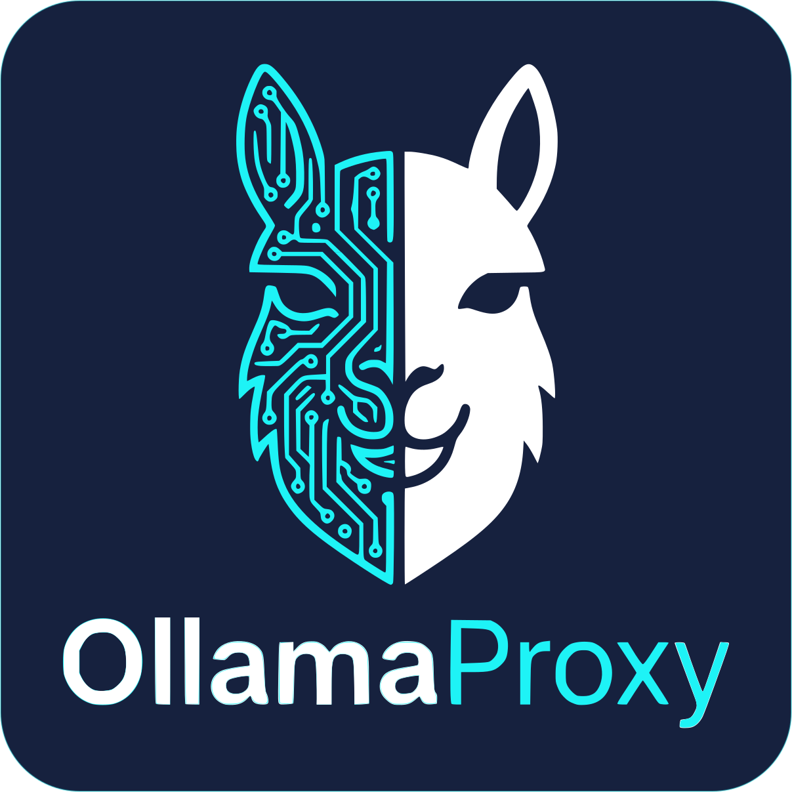

<div align="center">
  
</div>

<div align="center">
  <div style="width: 550px;">
    <table width="550">
      <thead>
        <tr>
          <th align="center" width="150">Platform</th>
          <th align="left">&nbsp;&nbsp;Build Status & Metrics</th>
        </tr>
      </thead>
      <tbody>
        <tr>
          <td align="center"><b>Windows</b></td>
          <td align="left">
            &nbsp;&nbsp;
            <a href="https://github.com/LumaCoreTech/OllamaProxy/actions/workflows/build.yml"></a>
            &nbsp;
            <a href="https://github.com/LumaCoreTech/OllamaProxy/actions/workflows/build.yml"></a>
            &nbsp;
            <a href="https://github.com/LumaCoreTech/OllamaProxy/actions/workflows/build.yml"></a>
          </td>
        </tr>
        <tr>
          <td align="center"><b>Ubuntu</b></td>
          <td align="left">
            &nbsp;&nbsp;
            <a href="https://github.com/LumaCoreTech/OllamaProxy/actions/workflows/build.yml"></a>
            &nbsp;
            <a href="https://github.com/LumaCoreTech/OllamaProxy/actions/workflows/build.yml"></a>
            &nbsp;
            <a href="https://github.com/LumaCoreTech/OllamaProxy/actions/workflows/build.yml"></a>
          </td>
        </tr>
      </tbody>
    </table>
  </div>
</div>

**Speak Ollama, run OpenAI.**

OllamaProxy is a lightweight reverse proxy that exposes the **Ollama API** on the outside while
forwarding and translating every request to one or more **OpenAI-compatible backends**
(OpenAI, Groq, OpenRouter, LM Studio, vLLM, llama.cpp, …).

It lets you point any Ollama-aware client — such as **GitHub Copilot Chat in Visual Studio** or
**Continue.dev** — at cloud or local OpenAI-compatible models, with per-model routing so you can,
for example, serve a lightweight local model and a heavy cloud model side by side and pick per task.

> [!NOTE]
> Built on **.NET 10** / ASP.NET Core Minimal API. Single self-contained service, configured via a
> small `appsettings.json` and environment variables.

---

## How it works

OllamaProxy rests on one observation: **the Ollama API and the OpenAI API describe the same operations
in two different dialects.** A client speaks Ollama to `http://localhost:11434`; the proxy resolves the
model, translates the request to its OpenAI-compatible backend, and translates the streaming response
back — so the client sees something indistinguishable from native Ollama.

Two ideas carry the rest:

- **One catalog.** At startup the proxy builds a single list of the models it offers, assembled from the
  ones you **pin** (the registry) and the ones it **discovers** by asking each backend what it serves.
- **Two surfaces, one port.** That catalog is advertised through *both* a native Ollama API (`/api/*`)
  and an OpenAI-compatible API (`/v1/*`) on the same port — some clients, like GitHub Copilot, use both
  at once (discovery over `/api`, chat over `/v1`).

→ Full request walkthrough and the two-host architecture: **[How it works](docs/how-it-works.md)**.

---

## Features

Most of these fall out of the translate-and-route model above; a few exist to make that model
pleasant to operate in practice.

- **A complete dual surface.** Both APIs are served in full, not just the chat route:
  - **Ollama-native:** `/api/chat`, `/api/generate`, `/api/tags`, `/api/show`, `/api/embeddings`,
    `/api/embed`, `/api/version`, `/api/ps`, plus a `/health` liveness probe.
  - **OpenAI-compatible:** `/v1/models`, `/v1/chat/completions`, `/v1/completions`, `/v1/embeddings`.

  Because both are present, OpenAI-native clients (including GitHub Copilot's chat path) connect
  unchanged — there is no feature that only works through one dialect.
- **Faithful streaming translation.** Responses are converted between OpenAI SSE and Ollama
  JSON-Lines *as they stream*, token by token, so nothing buffers. Tool-call deltas are carried
  across intact, which is what lets Copilot's tool and agent features light up.
- **Many backends behind one endpoint.** Route by model name to send a lightweight local model and a
  heavy cloud model side by side — the client only ever sees one Ollama URL and one flat model list.
- **Three operating modes on the same machinery.** The same catalog builder powers a spectrum from
  zero-config to fully pinned, so you can start loose and tighten later without changing tools:
  - **Plug-and-Play** — just a backend URL and key; every model and capability is auto-discovered.
  - **Hybrid** — pin the few models you care about, let the rest flow in automatically.
  - **Explicit** — a fully pinned registry with no auto-discovery, for reproducible production behavior.
- **Capability detection that Copilot relies on.** Tools, vision, completion, and embedding support
  are resolved from backend metadata and an optional active probe, falling back to a conservative
  completion-only default — the tool flag in particular is what unlocks Copilot's agent mode.
- **A graduation path, not a cliff.** Because mode is per backend, you can start a backend on
  Plug-and-Play, then pin the models you care about and tighten it to `Hybrid` or `Explicit` as the
  deployment matures — without changing tools or your client config.
- **Room to grow.** A provider abstraction keeps the translation core separate from each backend's
  quirks, so new upstreams (e.g. Anthropic, Grok) can be added without touching the request path.

---

## Quick start

The fastest path to the model above is Plug-and-Play: point the proxy at one backend, give it a key,
and let it discover everything else. You need the **.NET 10 SDK** and an API key for an
OpenAI-compatible backend.

**1. Configure one backend.** Edit [`src/OllamaProxy/appsettings.json`](src/OllamaProxy/appsettings.json) to point at one backend in Plug-and-Play mode.
OpenRouter is a good first target: it advertises rich capability metadata, so Plug-and-Play publishes a complete,
accurate catalog immediately. You only need to supply a key (preferably via an environment variable, see [Secrets](docs/configuration.md#secrets-and-environment-variables)):

```json
{
  "OllamaProxy": {
    "Backends": {
      "default": {
        "BaseUrl": "https://openrouter.ai/api/v1",
        "ProviderType": "openrouter",
        "Mode": "PlugAndPlay"
      }
    }
  }
}
```

**2. Provide the API key** via an environment variable so it never lands in a file:

```bash
# bash / zsh
export OllamaProxy__Backends__default__ApiKey="sk-or-..."
```

```powershell
# PowerShell
$env:OllamaProxy__Backends__default__ApiKey = "sk-or-..."
```

**3. Run it:**

```bash
dotnet run --project src/OllamaProxy
```

On startup the proxy queries each backend, builds the model catalog, and begins listening on the
conventional Ollama port (default `http://localhost:11434`). Verify it is up:

```bash
curl http://localhost:11434/api/version
curl http://localhost:11434/api/tags
```

Point any Ollama client at `http://localhost:11434` and you are done — because that is Ollama's
default port, most clients need no configuration at all.

Want to see what each backend offers and pin models without touching the file? The built-in
**[Administration UI](docs/administration-ui.md)** is live too — open `http://localhost:11435`.

> [!TIP]
> If startup fails immediately with a validation error, the most common cause is a missing or
> too-short API key. Every backend requires a key of at least **8 characters** — for local backends
> that ignore auth, supply any placeholder of sufficient length.

---

## Documentation

The full reference lives in [`docs/`](docs), split by topic so you can jump straight to what you need:

| Guide | What it covers |
| --- | --- |
| **[How it works](docs/how-it-works.md)** | The full request walkthrough, the "one catalog" model, and the two-host (chassis + inner proxy) architecture. |
| **[Architecture](docs/architecture/README.md)** | The engineering-facing map: the two-host cascade, DI composition, the request path, catalog & discovery, providers, and the admin pipeline (with diagrams). |
| **[Administration UI](docs/administration-ui.md)** | The built-in Blazor admin app: enabling it, the Backends page, pinning models, and applying changes live. |
| **[Configuration](docs/configuration.md)** | The complete `appsettings.json` reference: operating modes, backends, the model registry, capability detection, context window, reasoning effort, and secrets. |
| **[Endpoints](docs/endpoints.md)** | Every route on the Ollama-native (`/api`) and OpenAI-compatible (`/v1`) surfaces. |
| **[Editor integrations](docs/integrations.md)** | Wiring up GitHub Copilot (Visual Studio) and Continue.dev. |
| **[Example configurations](docs/examples.md)** | Three ready-to-copy configs from Plug-and-Play to fully pinned. |
| **[Deployment](docs/deployment.md)** | Running via Docker / Compose and the Windows MSI installer (including building and signing it). |
| **[Provider request handling](docs/provider-request-handling.md)** | How each provider adapter transforms requests on the way to its backend. |

---

## License

MIT License
