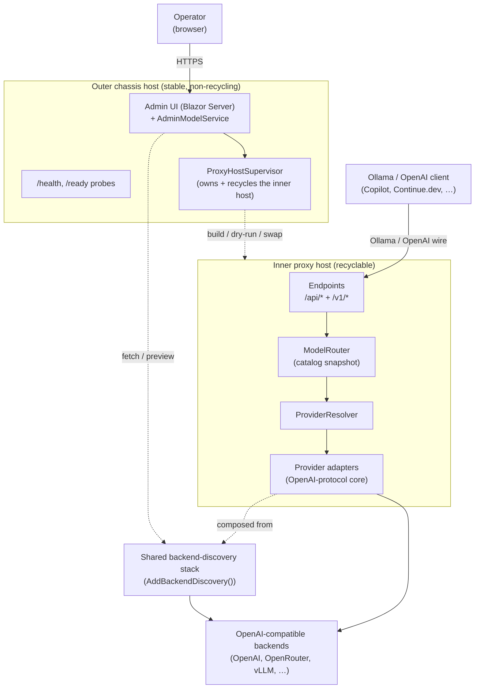

# Architecture

> Part of the [OllamaProxy documentation](../../README.md#documentation).

This section is the engineering-facing companion to [How it works](../how-it-works.md). Where that guide
explains *what* the proxy does (speak Ollama, run OpenAI), this section explains *how the code is put
together* and how the pieces fit — the map you (or a new contributor) want when changing the proxy rather
than just running it.

If you only have five minutes, read this page. Each section below links to a focused deep-dive.

## The one-paragraph version

OllamaProxy runs as **two hosts in a cascade**. A stable **outer chassis** anchors the process (Windows
Service or your shell), answers the `/health` and `/ready` probes, and hosts the Blazor **admin UI**. A
recyclable **inner proxy host** does the real work: it serves the Ollama and OpenAI surfaces on `:11434`,
routes each request to a backend, and translates between the two dialects. Because the chassis never
recycles, the admin UI can rebuild the inner host onto a new configuration *live* without dropping its own
connection. Both hosts compose the **same backend-discovery stack**, so what the admin previews and what the
proxy serves can never drift apart.

## Component map

Solid arrows are the live request path; dashed arrows are control and composition relationships.

## How to read this section

| Deep-dive | What it covers | Start here when you are… |
| --- | --- | --- |
| **[Hosting & the cascade](hosting.md)** | The two-host model, the recycle lifecycle, `HostMode`/fail-fast, the dry-run validation, and the two config files. | touching startup, the Windows Service, or the recycle path. |
| **[Composition & DI](composition.md)** | The `AddXxx` service-collection extensions that wire every subsystem together, and why the same block is shared by both hosts. | adding a service, changing a registration, or tracing where something is constructed. |
| **[Request path (data plane)](request-path.md)** | An inbound request from endpoint to backend and back, including model resolution and streaming translation. | working on endpoints, routing, or response translation. |
| **[Catalog & discovery (control plane)](catalog-and-discovery.md)** | How the startup catalog is built, the three operating modes, and capability probing. | changing how models are discovered, named, sized, or exposed. |
| **[Providers](providers.md)** | The provider adapter abstraction, the shared OpenAI-protocol translation core, and how concrete providers specialize it. | adding a backend type or changing translation behavior. |
| **[Admin subsystem](admin.md)** | The Blazor admin app and the fetch → reconcile → apply → recycle pipeline that reconfigures the inner host live. | working on the admin UI or the configuration-apply path. |

## Where the code lives

The runtime app is one project, `src/OllamaProxy`, organized by namespace folder:

| Folder | Role |
| --- | --- |
| `Hosting/` | The two-host cascade: the chassis, the inner host factory, and the supervisor. |
| `Endpoints/` | The Ollama (`/api`) and OpenAI (`/v1`) HTTP surfaces. |
| `Core/` | The routing core: the model router, the startup catalog builder, discovery, and the shared exposure rules. |
| `Providers/` | The provider abstraction and the OpenAI-protocol translation core plus concrete adapters. |
| `Configuration/` | The bound, validated options graph (`ProxyOptions` and friends). |
| `Contracts/` | The Ollama and OpenAI wire-format DTOs. |
| `Admin/` | The chassis-side admin model surface (fetch, reconciliation, config apply) and the Blazor UI. |
| `Diagnostics/` | Optional per-request tracing middleware and its sinks. |

The companion guides under [`docs/`](../../README.md#documentation) describe the same subsystems from an
operator's point of view: [Configuration](../configuration.md), [Endpoints](../endpoints.md),
[Administration UI](../administration-ui.md), and [Provider request handling](../provider-request-handling.md).
This section links into them wherever the behavior is configurable.
