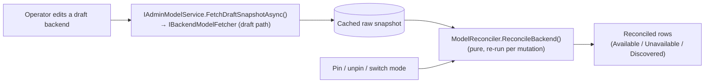
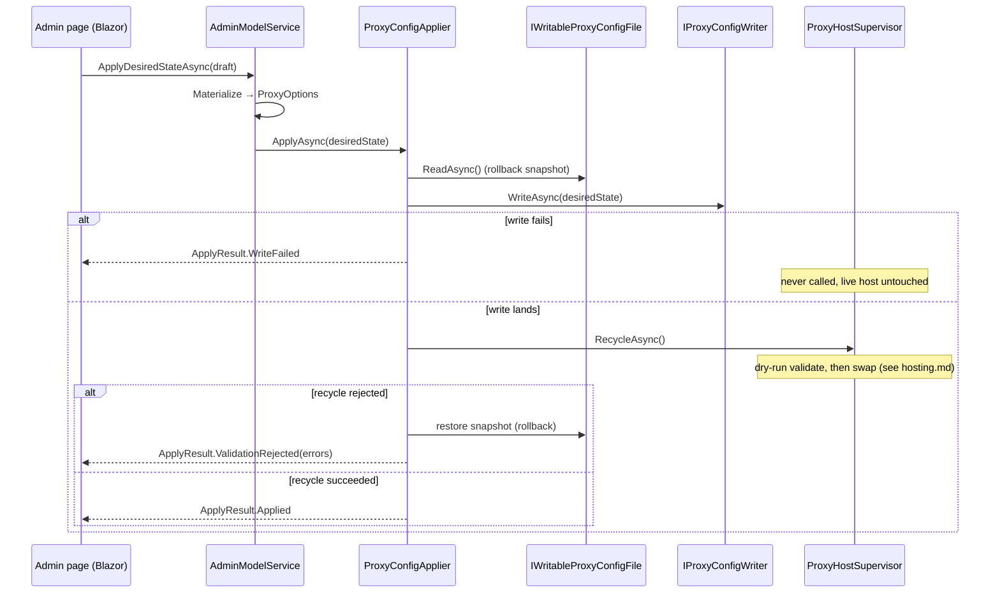

# Admin subsystem

> Part of the [OllamaProxy architecture docs](README.md).

The admin subsystem is the built-in Blazor app that lets an operator inspect backends, pin models, and
reconfigure the proxy **live**. This page covers how it is put together and, in particular, the
fetch → reconcile → apply → recycle pipeline that turns an edit in the browser into a running proxy on a new
configuration — without dropping anything.

For the operator-facing walkthrough (enabling it, the pages, what each control does), see the
[Administration UI](../administration-ui.md) guide. This page is the engineering view.

## Where it runs, and why

The admin UI is a **Blazor Server (Interactive Server)** app rendered on the **outer chassis**, not the
inner proxy host. That placement is the whole point:

- The chassis never recycles, so the admin UI's realtime circuit survives an inner-host rebuild.
- From the stable chassis the UI can *trigger* a recycle of the host it controls and keep showing the
  result.

It binds the inner proxy's `ProxyOptions` **tolerantly** (no fail-fast validation) against a
change-watching snapshot of the proxy's own files, so even a configuration that is broken *for the proxy*
still lets the admin surface load to fix it (see [Composition](composition.md#the-chassis-admin-block)).

## The pieces

The subsystem is a handful of small, single-purpose types. It helps to meet them before tracing the flow,
because the pipeline below is mostly these types handing off to one another:

| Type | Role |
| --- | --- |
| [`IAdminModelService`](../../src/OllamaProxy/Admin/IAdminModelService.cs) | The editing service the pages talk to: load, fetch, apply. |
| [`IBackendModelFetcher`](../../src/OllamaProxy/Admin/Fetch/IBackendModelFetcher.cs) | Fetches one draft backend's raw model snapshot, isolating its failures. |
| [`ModelReconciler`](../../src/OllamaProxy/Admin/Reconciliation/ModelReconciler.cs) | Pure merge of registry pins against a fetched snapshot → the rendered rows. |
| [`IProxyConfigApplier`](../../src/OllamaProxy/Admin/Config/IProxyConfigApplier.cs) | Persists the desired state and recycles the inner host onto it. |
| [`IProxyConfigWriter`](../../src/OllamaProxy/Admin/Config/IProxyConfigWriter.cs) | Rewrites only the `OllamaProxy` section of the operator file. |
| [`IAdminCatalogService`](../../src/OllamaProxy/Admin/Catalog/IAdminCatalogService.cs) | The read-only "what is the proxy serving *right now*" view. |
| [`DesiredStateMaterializer`](../../src/OllamaProxy/Admin/Editing/DesiredStateMaterializer.cs) | Converts between the editable draft and the authoritative `ProxyOptions`. |

The pages — `Backends.razor`, `Configuration.razor`, `Models.razor` — bind to `IAdminModelService` and
render its results.

## Fetch and reconcile (the editor loop)

The Backends editor needs to show what each backend currently offers *as the operator edits it*, before
anything is committed. It separates the two costs:

- **Fetch is costly and fallible** (an HTTP round-trip to the backend). It runs once per backend.
- **Reconcile is pure and cheap** (no I/O). It re-runs on every pin, unpin, or mode switch.

`AdminModelService.MaterializeForFetch()` turns the draft into the concrete `BackendOptions` a fetch discovers
against. Part of that materialization is recovering the **write-only API key**: it reads the saved secret
from the live snapshot by `OriginalName`, so a draft that left its key blank still authenticates, and the
browser never holds the secret. The fetcher then runs the
[shared discovery pipeline](catalog-and-discovery.md) through the draft path, so the editor sees the effect
of a changed URL or provider without committing first.

`ModelReconciler` then merges the backend's own registry pins against that snapshot, matching on the
**upstream** model identifier, and labels each row:

- **Available** — a pin whose upstream model the snapshot still offers.
- **Unavailable** — a pin the snapshot no longer offers (pins are never dropped).
- **Discovered** — a snapshot model no pin references.

Because it resolves names, context windows, and capabilities through the same
[`ModelExposureRules`](catalog-and-discovery.md#the-shared-exposure-rules) the runtime catalog uses, a model
the operator pins is named and sized in the preview exactly as the proxy would expose it on the next start.

A fast refresh fetches with `NeverProbe`; the on-demand capability probe uses `ProbeAll` and can stream
candidates in via `ProbeDraftStreamingAsync()`, filling the table top-to-bottom while probing the rows below
concurrently.

## Apply and recycle (the commit)

When the operator clicks **Apply**, the whole edited state is committed as **one transactional change**.
`Configuration.razor`/`Backends.razor` call `IAdminModelService.ApplyDesiredStateAsync()`, which materializes
the draft into an authoritative `ProxyOptions` and hands it to the applier.

Three properties make this safe:

- **Whole-section authoritative.** The writer replaces the entire `OllamaProxy` section (preserving sibling
  sections), so the committed state *is* the desired state — no partial merge.
- **Validated before it goes live.** The applier doesn't validate the config itself; it delegates to
  `RecycleAsync()`, whose dry-run on a [`NoopServer`](hosting.md#the-dry-run-server) is the single gate. A
  rejected candidate leaves the live host serving the previous configuration.
- **Rollback on reject.** A rejected recycle would otherwise leave a bad file on disk that the *next*
  restart would load with no dry-run. So the applier snapshots the file before writing and restores it on
  reject, keeping disk in sync with what is live. Rollback is best-effort: if it fails, the operator still
  has the validation errors and a log pointer.

The `ApplyResult` the UI receives ([`ApplyResult.cs`](../../src/OllamaProxy/Admin/Config/ApplyResult.cs))
carries one of three outcomes — `Applied`, `WriteFailed`, or `ValidationRejected(errors)` — which the page
renders as a success banner or an actionable error list.

## The live-catalog view

Separate from the editor, [`IAdminCatalogService`](../../src/OllamaProxy/Admin/Catalog/AdminCatalogService.cs)
backs the **Models** page. It reads the running inner host's resolved catalog through the supervisor's
`GetLiveModels()` (a lock-free read of the published snapshot), so it shows exactly what the proxy is
serving *right now* — as opposed to the Backends editor, which re-discovers each backend against its draft.
The two views answer different questions: "what would this edit expose?" versus "what is exposed today?".
