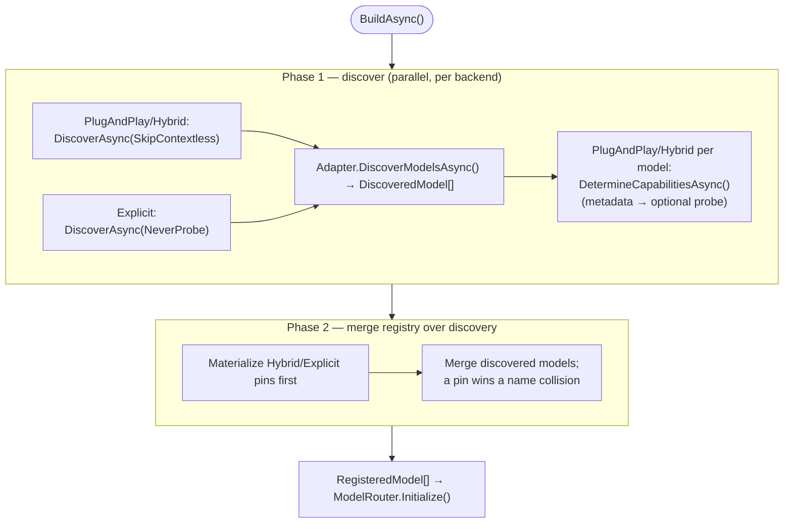

# Catalog & discovery (control plane)

> Part of the [OllamaProxy architecture docs](README.md).

The [request path](request-path.md) resolves each call against a **catalog** of models. This page explains
how that catalog is *built* — the control plane that runs once at startup (and again, in preview form,
inside the [admin subsystem](admin.md)).

The catalog answers one question for every client-facing model name: *which backend serves it, under which
upstream identifier, with which capabilities and context window?*

## One catalog from two sources

Every model in the catalog comes from one of two sources, per backend:

- **Discovered** — the proxy asks the backend what it serves (`/models`) and exposes the result.
- **Pinned** — the operator lists a model in the backend's registry (`Models`), with optional explicit settings.

How those two combine is decided by the backend's **operating mode**.

## The three operating modes

The operating mode is the dial that decides how discovered and pinned models combine for a backend.
[`OperatingMode`](../../src/OllamaProxy/Configuration/OperatingMode.cs) is a **per-backend** setting, so one
proxy can run a trusted local backend wide open and a metered cloud backend locked down. All three modes run
on the same machinery and differ in which source is published. Runtime discovery may still run for metadata
enrichment, but exposure remains mode-gated:

| Mode | Discovered models | Pinned (registry) models | Runtime discovery |
| --- | --- | --- | --- |
| `PlugAndPlay` | All, with detected capabilities. | Ignored (logged as a warning). | Full discovery with capability probing where metadata is inconclusive. |
| `Hybrid` | All. | Honored; **win on name collision**. Pins with no discovered match are still published. | Full discovery with capability probing where metadata is inconclusive. |
| `Explicit` | Never auto-exposed. | Only these are exposed. | Metadata-only discovery (`NeverProbe`) may enrich pins with provider metadata, but never exposes unpinned models. |

That distinction is important: `Explicit` is explicit about **serving**. Operational settings for a model —
its client-facing name, upstream id, capabilities, context override, and pinned reasoning effort — come from
the registry entry. The backend's listing can still be cheap and useful metadata, especially for creation
timestamps, descriptions, pricing, and provider-specific model facts, so the runtime may read it without
letting it widen the served catalog.

The three modes form a graduation path, the one the [README](../../README.md) describes. You start a backend
on `PlugAndPlay` to see everything it offers, then pin the models you care about and tighten to `Hybrid` or
`Explicit`. Clients never change, because tightening the mode only narrows which models the same catalog
publishes.

When a backend leaves `Mode` unset, the effective mode is itself provider-aware. It resolves through
`IProviderCatalog.ResolveMode()`, so a provider that advertises rich metadata (OpenRouter) can default
to `PlugAndPlay`, while a capability-poor one defaults to a safer mode.

### What runs in each mode

Step by step, here is which part of the pipeline runs for a backend — and, just as importantly, which is
skipped:

| Pipeline step | `PlugAndPlay` | `Hybrid` | `Explicit` |
| --- | --- | --- | --- |
| Discovery call (`/models`) | ✅ full | ✅ full | ✅ metadata-only |
| Capability probing | ✅ `SkipContextless`¹ | ✅ `SkipContextless`¹ | ❌ `NeverProbe` |
| Registry (`Models`) honored | ❌ ignored (logged as a warning) | ✅ | ✅ (sole source of served models) |
| Discovered models auto-exposed | ✅ all | ✅ all | ❌ never |
| Pins inherit reported window + provider metadata² | — (mode has no pins) | ✅ | ✅ |

¹ `SkipContextless` probes a model only when the listing's capability metadata is inconclusive **and** the
model has a resolvable context window — a window-less model is dropped by the merge anyway. Metadata-rich
providers (Venice, OpenRouter) answer from the listing, so no probe fires. The admin **Probe capabilities**
action overrides this with `ProbeAll`; see [capability detection](#capability-detection).

² Only when the backend's listing actually reports them. A strict OpenAI or Groq listing carries neither, so
an `Explicit` pin there still needs its own `ContextLength` (see [the shared exposure rules](#the-shared-exposure-rules)).

Two things fall out of this. **`PlugAndPlay` and `Hybrid` differ only in the registry** — `Hybrid` honors your
pins, `PlugAndPlay` ignores them. **`Hybrid` and `Explicit` differ only in probing and auto-exposure** — both
honor the registry and both enrich pins from the listing, but `Explicit` never probes and never serves an
unpinned model. So an `Explicit` backend's discovery still runs; it just reads listing metadata, while a
model's capabilities come from its registry entry rather than a probe.

## Building the catalog

With the modes defined, here is how the catalog is actually assembled.
[`ModelCatalogBuilder.BuildAsync()`](../../src/OllamaProxy/Core/ModelCatalogBuilder.cs) builds it in two
phases, and the order is deliberate: discover first, then merge the registry over what discovery found.

**Why discovery runs first.** When a backend advertises a context window during discovery (vLLM's
`max_model_len`, or the window OpenRouter and Venice report), a `Hybrid` backend's pin must be able to
*inherit* it. Not every backend advertises one — a strict OpenAI backend reports none — and if the registry
were materialized first, a pin without an explicit override would be capped at the backend default (or fail
outright when no default is set). Running discovery first lets a pin inherit the live window, exactly as the
admin preview resolves it. For `Explicit`, the same pre-pass is metadata-only: it can enrich pins with
descriptive provider metadata (for example pricing) without probing capabilities and without auto-exposing
anything the operator did not pin.

**Failure isolation.** A backend that fails discovery is logged and skipped, so one unreachable backend
cannot stop the proxy from starting with the others.

The two phases hand a `RegisteredModel[]` to the router — each the catalog entry that pairs a client-facing
name with its serving backend, upstream identifier, capabilities, and context window. The hosted service that
drives this is covered under [publishing](#publishing-to-the-router) below.

The sections that follow zoom into those two phases: the [exposure rules](#the-shared-exposure-rules) that
name and size every model, the [capability detection](#capability-detection) that classifies it, and the
[`BackendModelDiscovery`](#the-discovery-pipeline-two-shapes) orchestrator that runs discovery for each
backend.

## The shared exposure rules

Discovery and the merge produce raw facts about a model; turning those into the *client-facing* name, size,
and capabilities is a separate concern with one owner.
[`ModelExposureRules`](../../src/OllamaProxy/Core/ModelExposureRules.cs) holds that logic, and both the
runtime catalog and the admin preview call it. That shared ownership is the guarantee that a model is named
and sized identically whether it is exposed at startup or previewed in the admin UI. The three rules are:

- **`ApplyClientFacingPrefix(prefix, bareName)`** applies the optional backend prefix. With no prefix the
  bare name is returned unchanged, which keeps short names for single-backend setups; otherwise the name
  becomes `prefix/model`. The prefix changes only the *client-facing* name. The identifier sent upstream is
  never prefixed.
- **`ResolveEffectiveContextWindow(explicitOverride, reported, backendDefault)`** resolves the context
  window by a strict precedence. An explicit per-model override wins first, then the value the backend
  reported during discovery, then the operator-configured backend default. The default only fills a gap; it
  never narrows a window the backend actually reports. When no source supplies a window it returns `null`,
  and each caller then applies its own policy: discovery skips and warns, a pin treats it as a fatal config
  error, and the admin surface flags it before commit.
- **`ResolveRegisteredCapabilities(...)`** resolves a registry entry's capabilities.

Keeping all three in one type is what guarantees the admin preview cannot drift from runtime behavior.

## Capability detection

Each discovered model's capabilities (tools, vision, completion, embedding) are resolved by the adapter's
`DetermineCapabilitiesAsync()`, recording **where** the answer came from via
[`CapabilitySource`](../../src/OllamaProxy/Providers/Abstractions/ModelCapabilities.cs):

| `CapabilitySource` | Meaning |
| --- | --- |
| `Configured` | Taken verbatim from explicit registry configuration. |
| `ProviderMetadata` | Derived from the backend's model-listing metadata. |
| `Probed` | Confirmed by an active probe against the backend. |
| `Default` | No signal was available; conservative (completion-only) defaults were applied. |

The resolution strategy is **metadata first, then an optional active probe**, then a conservative default.
The adapter reads any capability signal the backend's metadata already carries. When the metadata is silent,
an active probe can confirm a capability directly; when even that is unavailable, the conservative
(completion-only) default applies. Probing is what a capability-poor backend needs to light up tools. A
strict OpenAI endpoint that lists no metadata, for example, only reveals tool support when probed, and the
tool flag in particular is what unlocks Copilot's agent mode.

Whether probing runs at all is governed by a
[`DiscoveryProbePolicy`](../../src/OllamaProxy/Core/DiscoveryProbePolicy.cs), and the two callers choose
differently:

| Caller | Policy | Effect |
| --- | --- | --- |
| Runtime startup, `PlugAndPlay` / `Hybrid` | `SkipContextless` | Probe models that have an effective context window; skip context-less models that would not be exposed anyway. |
| Runtime startup, `Explicit` | `NeverProbe` | Read provider listing metadata for pin enrichment, but do not probe capabilities. Registry capability flags remain authoritative. |
| Admin fast refresh | `NeverProbe` | Fetch the model list quickly for every mode, showing provider metadata when available but avoiding active probes. |
| Admin **Probe capabilities** action | `ProbeAll` | Probe every fetched model on demand, regardless of mode or context-window availability. |

When probes do run, they are bounded **per backend** by `backend.Probing.MaxConcurrentProbes` (a
`SemaphoreSlim` gate in `BackendModelDiscovery`), so one provider's rate limits never throttle another's.
The prober and its settings live under `Providers/OpenAiProtocol`; see [Providers](providers.md).

## The discovery pipeline, two shapes

Everything above (discovery, exposure, probing) is orchestrated by one component, used by both the runtime
and the admin surface. [`BackendModelDiscovery`](../../src/OllamaProxy/Core/BackendModelDiscovery.cs) is a
**pure, stateless** orchestration, and it exposes the same per-model resolution in two shapes for two
different consumers:

- **`DiscoverAsync()`** buffers the whole batch in reported order — what the startup catalog wants for a
  deterministic merge.
- **`DiscoverStreamingAsync()`** yields each candidate in client-name order (matching the admin table's
  sort), so the admin surface fills its list top-to-bottom while still probing the rows below concurrently.

Both produce `DiscoveryCandidate`s — the raw `DiscoveredModel` the adapter returned, now named, sized, and
capability-resolved — so downstream consumers (the catalog merge, the admin reconciler) never re-derive those
attributes.

The admin surface deliberately discovers through the same pipeline for **all** modes. A backend in `Explicit`
therefore still shows its available upstream models in the Backends page so the operator can pin them, but
the runtime catalog exposes only the registry entries after the configuration is applied.

## Publishing to the router

The builder produces a catalog; this is how it reaches the running proxy.
[`ModelDiscoveryHostedService`](../../src/OllamaProxy/Core/ModelDiscoveryHostedService.cs) is an
`IHostedService` whose `StartAsync()` the inner host **awaits during startup**, so the catalog is guaranteed
present before the first request arrives. It calls `BuildAsync()`, then publishes via
`IModelCatalogInitializer.Initialize()`, which swaps the router's immutable snapshot in one atomic
assignment.

An **empty** catalog is not fatal — it is logged as a warning. The proxy still answers status endpoints and
returns clear "model not found" errors rather than refusing to boot, which keeps a misconfigured deployment
diagnosable instead of dead.

For the operator-facing view of all of this — modes, registries, context window, reasoning effort — see the
[Configuration](../configuration.md) guide.
