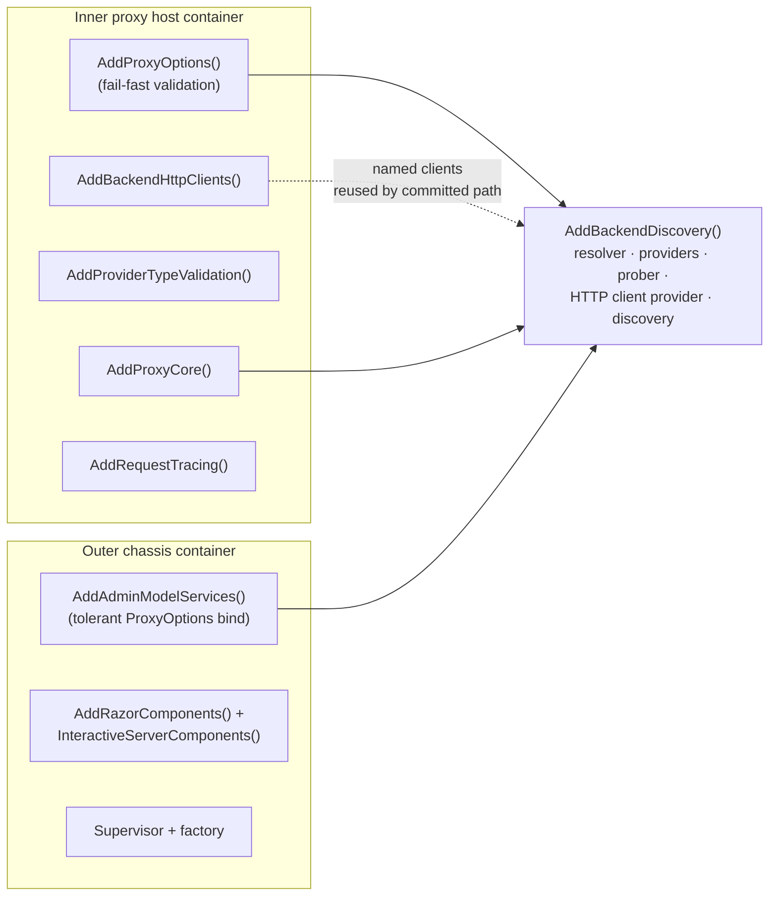

# Composition & DI

> Part of the [OllamaProxy architecture docs](README.md).

OllamaProxy wires its subsystems together with a set of focused `AddXxx` service-collection extensions.
Reading them in order is the fastest way to understand what each host is made of and where any given
service is constructed. This page is that reading guide.

## Two containers, one shared block

The [cascade](hosting.md) runs two hosts, and each builds its **own** service container. They are composed
in two different places:

- The **inner proxy host** ([`ProxyHostFactory`](../../src/OllamaProxy/Hosting/Cascade/ProxyHostFactory.cs)) composes the full request-serving stack.
- The **outer chassis** ([`Program.cs`](../../src/OllamaProxy/Program.cs)) composes the admin surface.

Two separate containers would normally risk two subtly different views of the world. The proxy avoids that
by having both compose the **same** block: `AddBackendDiscovery()`. Because the runtime catalog and the
admin preview discover models through identical code, what the operator previews and what the proxy serves
cannot drift. That shared block is the thread to follow through the rest of this page.

A second thread runs alongside it. The shared block deliberately does *not* bind the options itself; it
leaves that to each host, which is what lets one block serve a **fail-fast inner host** and a **tolerant
chassis**. This page keeps returning to that split.



`AddBackendDiscovery()` is composed once per container, by both hosts.

Throughout this page, a *committed* backend is one saved in the running configuration; a *draft* is one
being edited in the admin UI but not yet applied (see [Admin subsystem](admin.md)).

## The inner proxy host, block by block

The inner host composes the full serving stack in one readable sequence. Each line is a focused `AddXxx`
call, so reading them top to bottom tells you everything the host is made of. This is the order
[`ProxyHostFactory.CreateProxyHost()`](../../src/OllamaProxy/Hosting/Cascade/ProxyHostFactory.cs) calls them:

| Call | Registers | Notes |
| --- | --- | --- |
| `AddInnerProxyHosting()` | The writable `IDataDirectory`, the ProgramData config overlay, the Event Log under the service. | Hosting concerns only; **not** the service lifetime. |
| `AddProxyOptions()` | `IOptions<ProxyOptions>` bound to the `OllamaProxy` section. | **Fail-fast**: `ValidateDataAnnotations()` + `ValidateOnStart()`. |
| `AddBackendHttpClients(config)` | The per-backend resilient named `HttpClient`s. | The committed-backend request path sends through these. |
| `AddBackendDiscovery()` | The shared discovery stack (below). | Same block the chassis composes. |
| `AddProviderTypeValidation()` | An `IValidateOptions<ProxyOptions>` that rejects unknown provider types. | **Inner host only** — it depends on the fail-fast bind. |
| `AddProxyCore()` | The routing core and the startup discovery hosted service (below). | |
| `AddRequestTracing()` | The tracing middleware and its sinks. | Middleware is a no-op unless tracing is enabled. |

## The shared discovery block

This is the block both hosts compose, and the reason a preview can never disagree with what runs.
[`AddBackendDiscovery()`](../../src/OllamaProxy/Core/BackendDiscoveryServiceCollectionExtensions.cs) is host-agnostic: it registers everything needed to turn a backend definition into a set
of discovered models, and nothing host-specific. It registers:

- `TimeProvider.System` — the clock injected wherever durations and timestamps are produced (`TryAdd()`, so a
  test's deterministic clock is kept).
- `IRequestTraceAccessor` → `RequestTraceAccessor` — the ambient trace seam. On the chassis (no tracing
  middleware) its `Current` scope is the null object, so adapters run safely without a request pipeline.
- `IHttpClientFactory` infrastructure and `IBackendHttpClientProvider` → `BackendHttpClientProvider` —
  resolves a `BackendContext` to its `HttpClient` (a named client for a committed backend, or an ad-hoc
  client built from inline options for a draft).
- `AddProviders()` — one `IProviderAdapter` per provider type, plus the capability prober and the
  reasoning-details cache (see [Providers](providers.md)).
- `IProviderResolver` → `ProviderResolver` — pairs a backend with its adapter.
- `IBackendModelDiscovery` → `BackendModelDiscovery` — the stateless discover-then-resolve pipeline.

Two rules govern this block, and both are documented on the method itself:

- **Bind options first.** The adapters need `IOptions<ProxyOptions>` and the prober needs
  `IOptionsMonitor<ProxyOptions>`, so the options graph must already be registered before this call runs.
  The block deliberately does **not** bind `ProxyOptions` itself. That binding is host-specific: fail-fast
  on the inner host, tolerant on the chassis. Leaving it to the caller is what lets one shared block serve
  two hosts with opposite validation policies.
- **Compose at most once per container.** It registers one adapter per provider type, so composing it twice
  would make adapter selection ambiguous. Every registration uses `TryAdd()`, so the block still layers
  safely on top of a host that already supplied one of these services (for example a test's clock).

## The routing core block

The shared block discovers models; the routing core is what *serves* them. It is registered by
[`AddProxyCore()`](../../src/OllamaProxy/Core/CoreServiceCollectionExtensions.cs), and its shape exists to
solve one problem: the catalog is written once at startup, but read concurrently by every request.
The registration sets up that read/write split:

```csharp
services.AddSingleton<ModelRouter>();
services.AddSingleton<IModelRouter>(sp => sp.GetRequiredService<ModelRouter>());             // read side (endpoints)
services.AddSingleton<IModelCatalogInitializer>(sp => sp.GetRequiredService<ModelRouter>()); // write side (discovery)
services.AddSingleton<ModelCatalogBuilder>();
services.AddHostedService<ModelDiscoveryHostedService>();
```

One `ModelRouter` instance sits behind **two intent-revealing interfaces**. Endpoints resolve through the
read-side `IModelRouter`, while startup discovery publishes through the write-side
`IModelCatalogInitializer`. Both interfaces point at the same instance, so a request and a catalog rebuild
see one shared volatile snapshot rather than two divergent objects. The supervisor in `Program.cs` uses the
same one-instance-behind-two-interfaces pattern.

This block depends on the shared block: the catalog builder and the discovery service resolve their
`IProviderResolver` and clock from it. Only *presence* in the final container matters, not registration
order, because both blocks resolve their dependencies at run time rather than at registration.

## The chassis admin block

The chassis composes the same shared block, but wraps it differently because it edits configuration rather
than serving traffic. [`AddAdminModelServices()`](../../src/OllamaProxy/Admin/AdminServiceCollectionExtensions.cs) composes the admin surface, and it differs from the inner host
in two deliberate ways:

- **Tolerant `ProxyOptions` bind.** It binds the supplied proxy-config snapshot **without**
  `ValidateDataAnnotations()` / `ValidateOnStart()`. A proxy configuration that is invalid for the running
  proxy must still let the admin surface load so the operator can *fix* it. Validation is the inner host's
  job.
- **No committed HTTP clients.** It composes `AddBackendDiscovery()` (resolver, providers, prober) but does
  **not** register the per-backend named clients. The fetcher always resolves through the *draft* path,
  building an ad-hoc client from the freshly bound options, so a fetch reflects the current snapshot.

On top of the shared block it adds `IBackendModelFetcher`, `IAdminModelService`, `IAdminCatalogService`,
`IProxyConfigWriter`, and `IProxyConfigApplier` — the fetch, reconcile, and apply services covered in the
[Admin subsystem](admin.md) deep-dive.

## Provider-type validation, only where it belongs

One block is registered on the inner host alone, and it is worth understanding why.
[`AddProviderTypeValidation()`](../../src/OllamaProxy/Providers/ProviderServiceCollectionExtensions.cs) adds a rule that every configured backend must name a registered provider type,
and that the default provider type resolves. The inner host binds its options fail-fast, so this rule turns a typo
into a clear startup error instead of a failed adapter lookup on the first request. The chassis binds the same options
tolerantly and deliberately omits the rule, because the admin surface must still load on a broken config to fix it.

That split is the recurring theme of the whole composition: a **fail-fast inner host** that refuses to
serve a bad configuration, and a **tolerant chassis** that always loads so you can repair one.
