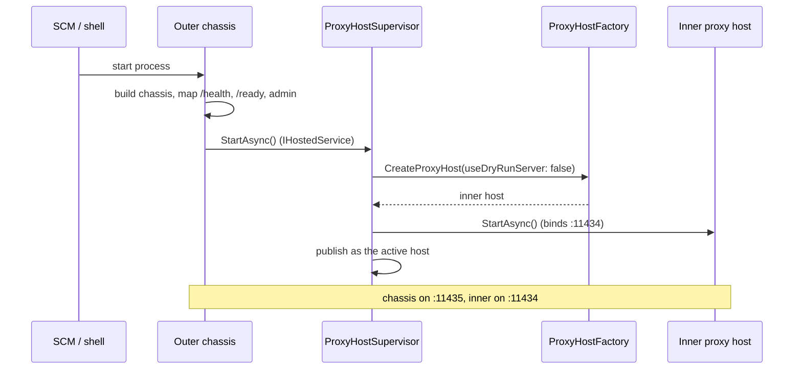
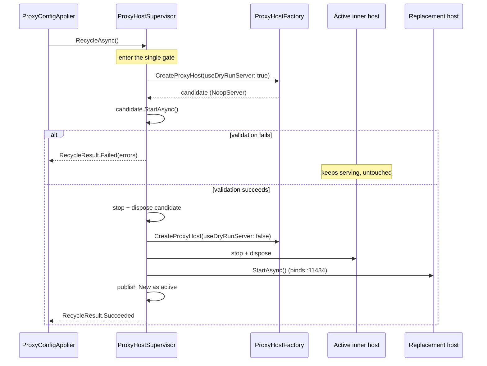

# Hosting & the cascade

> Part of the [OllamaProxy architecture docs](README.md).

OllamaProxy does not run as a single web host. It runs as **two**, nested in a cascade: a stable **outer
chassis** and a recyclable **inner proxy host**. This page explains why, how the two relate, and the
lifecycle that lets the proxy be reconfigured live.

## Why two hosts

The proxy needs two things that pull in opposite directions:

- **Stability.** A reconfigure rebuilds the proxy engine, so one process must stay resident across that
  rebuild — otherwise the admin UI's realtime connection (the Blazor circuit) would drop mid-change. This
  holds in every hosting mode: console, container, or Windows Service. When the proxy *does* run as a
  Windows Service, that same resident process is additionally what the Service Control Manager (SCM) talks
  to, so it must not go down on a recycle.
- **Reconfigurability.** Applying a configuration change (a new backend, a different model pin) means
  rebuilding the routing core and re-running discovery. The cleanest way to do that is to build a fresh
  host on the new configuration.

A single host cannot both *stay put* and *rebuild itself*. So the process splits the roles:

| | Outer chassis | Inner proxy host |
| --- | --- | --- |
| Lifetime | The whole process; never recycles. | Rebuilt on every apply; can come and go. |
| Anchors | The SCM contact and the foreground shell. | Nothing — it lives beneath the chassis. |
| Serves | `/health`, `/ready`, and the admin UI on `:11435`. | The full Ollama + OpenAI surface on `:11434`. |
| Config file | `hostsettings.json` | `appsettings.json` |
| Built in | [`Program.cs`](../../src/OllamaProxy/Program.cs) | [`ProxyHostFactory`](../../src/OllamaProxy/Hosting/Cascade/ProxyHostFactory.cs) |

Because the chassis never recycles, it can tear down and rebuild the inner host *live* — without losing
its SCM anchor or the Blazor circuit the operator is using to trigger the change.

## The outer chassis

[`Program.cs`](../../src/OllamaProxy/Program.cs) is the process entry point, and it builds **only the chassis**. It never constructs the proxy engine itself.
Instead it registers the two collaborators that build and own that engine on its behalf — the **factory** and
the **supervisor** — and then maps the probes and the admin surface. Reading the entry point top to bottom:

1. **Pin the content root, then load the chassis config.** A Windows Service starts with its working
   directory in `System32`, so the content root is pinned to the executable's directory first.
   `AddOuterChassisHosting()` then loads `hostsettings.json` *instead of* `appsettings.json` and, under the
   service, takes ownership of the **Windows Service lifetime**, the Event Log, and the ProgramData overlay.
   Owning the service lifetime here is deliberate: the chassis is the process the SCM talks to, so the inner
   host must not claim it (see [the inner proxy host](#the-inner-proxy-host) below).
2. **Bind and validate the chassis options.** `AdminOptions` carries the admin URL and the on/off switch;
   `ChassisOptions` carries the run mode. Both validate on start, so a malformed chassis config fails
   immediately rather than at first use.
3. **Give the admin UI its own view of the proxy config.** The admin surface lives on the chassis but edits
   the *inner* proxy's settings, and the chassis never loads `appsettings.json` itself. So it builds a
   dedicated, change-watching snapshot of that file's `appsettings.*` layering
   (`BuildProxyOptionsConfiguration()`) and binds the admin model services against it. The binding is
   **tolerant**: a proxy config too broken for the proxy to run must still let the admin UI load so an
   operator can repair it. (See [Composition & DI](composition.md#the-chassis-admin-block).)
4. **Register the Blazor admin components.** `AddRazorComponents().AddInteractiveServerComponents()` sets up
   the Interactive Server UI. The registration is unconditional but harmless on its own: nothing is
   reachable until the routes are mapped below, and only when the admin surface is enabled.
5. **Register the factory and the supervisor — the proxy's machinery.** This is the part that actually runs
   the data plane, one indirection removed:
   
   - The **factory** ([`IProxyHostFactory`](../../src/OllamaProxy/Hosting/Cascade/ProxyHostFactory.cs)) builds a fresh inner proxy host on demand.
   - The **supervisor** ([`IProxyHostSupervisor`](../../src/OllamaProxy/Hosting/Cascade/ProxyHostSupervisor.cs)) owns the *single* live inner host. It starts one,
     hands out its live model catalog, and performs validated recycles when the configuration changes.
   
   Crucially, the supervisor is also registered as an `IHostedService`. That registration is the hinge that
   lets the chassis start the proxy without knowing anything about it — see [How the chassis starts the proxy](#how-the-chassis-starts-the-proxy) below.
6. **Pin the chassis to its admin port.** `UseUrls(adminUrl)` plus `PreferHostingUrls(true)` keep the
   chassis on its *own* configured URL, so an ambient `ASPNETCORE_URLS` or a container's data-plane override
   (`OllamaProxy__ListenUrl`) cannot silently move the chassis onto the proxy port. This guards against
   *accidental* collisions from shared environment variables; it does not reconcile a deliberate one. If you
   point `Admin:Url` and `OllamaProxy:ListenUrl` at the same address, the two hosts still collide and one
   fails to bind at startup. The defaults (`:11434` and `:11435`) keep them apart — keep them on distinct
   ports.

After `builder.Build()`, the chassis maps just two probes plus the opt-out admin surface:

- **`/health`** — liveness. Under the daemon policy it answers *even when the inner proxy failed to
  start*, which is what keeps the chassis reachable for a recovering recycle.
- **`/ready`** — readiness. Returns `503` unless `IProxyHostSupervisor.IsInnerHostActive` is true, so an
  orchestrator routes data-plane traffic only when a proxy is actually serving.

The admin surface is gated at **mapping** time, not registration time: with `AdminOptions.Enabled = false`
no admin route is mapped and no realtime hub starts, leaving only the two probes.

## How the chassis starts the proxy

Nothing above starts the proxy engine. The entry point only *registers* the supervisor as an
`IHostedService`. When the chassis host starts, the hosting runtime calls `StartAsync()` on every hosted
service, the supervisor included, and that is the moment the inner host comes up:



Read it as a chain of custody: the SCM starts the chassis, the chassis starts the supervisor, and the
supervisor builds and starts the inner host. The same supervisor later *rebuilds* that inner host on every
configuration apply, which is the [recycle lifecycle](#the-supervisor-and-the-recycle-lifecycle) detailed below.

## The inner proxy host

The inner host is the proxy engine: the routing core, the providers, and the full Ollama + OpenAI surface.
The supervisor never builds it by hand — it asks the factory.
[`ProxyHostFactory.CreateProxyHost()`](../../src/OllamaProxy/Hosting/Cascade/ProxyHostFactory.cs) assembles that
host with the exact pipeline the proxy used to run as a single host, so a recycled host follows the same
build path as a cold start and only its configuration differs. In order, the factory:

1. **Sets up inner-host hosting concerns.** `AddInnerProxyHosting()` configures the writable data
   directory, the ProgramData `appsettings` overlay, and the Event Log provider under the service. It
   pointedly does **not** register the service lifetime: that belongs to the chassis
   (see step 1 of [the outer chassis](#the-outer-chassis)), so the inner host can be torn down and rebuilt
   without disturbing the SCM contact.
2. **Binds the proxy options and HTTP clients.** `AddProxyOptions()` binds and validates `ProxyOptions`
   **fail-fast** — the opposite of the chassis's tolerant bind, because a host that is about to *serve*
   traffic must reject a broken config rather than start on it. `AddBackendHttpClients()` then registers the
   per-backend resilient HTTP clients the providers send requests through.
3. **Pins the inner host to its data-plane port.** `UseUrls(ProxyOptions.ListenUrl)` +
   `PreferHostingUrls(true)` bind the inner host to its *own* configured proxy address (`:11434` by
   default), the same way the chassis pins itself. As long as the two URLs resolve to distinct ports (the
   defaults do), the hosts never contend for one.
4. **Composes the engine.** Four DI blocks build the actual proxy: the shared discovery stack
   (`AddBackendDiscovery()`), provider-type validation (`AddProviderTypeValidation()`, registered on the inner
   host **only**, since this is the host that must fail-fast on an unknown provider), the routing core
   (`AddProxyCore()`), and request tracing (`AddRequestTracing()`).
5. **Maps the surface.** `MapOllamaApi()` maps the Ollama + OpenAI endpoints, with the tracing middleware
   wrapping the whole pipeline so it sees both the inbound request and the final response.

See [Composition & DI](composition.md) for what each of those `AddXxx` blocks registers, and [The request path](request-path.md)
for how a request flows through the assembled host.

### The dry-run server

`CreateProxyHost(useDryRunServer: true)` swaps Kestrel for a [`NoopServer`](../../src/OllamaProxy/Hosting/Cascade/NoopServer.cs):

```csharp
if (useDryRunServer)
{
    builder.Services.RemoveAll<IServer>();
    builder.Services.AddSingleton<IServer, NoopServer>();
}
```

A dry-run host performs the **full DI build, options validation, and startup discovery** — everything
that can fail on a bad configuration — *without* binding the proxy port the live host already holds. This
is the heart of validated, safe recycles.

## The supervisor and the recycle lifecycle

We met the [`ProxyHostSupervisor`](../../src/OllamaProxy/Hosting/Cascade/ProxyHostSupervisor.cs) as the thing the chassis starts; this is what it does once running.
It owns the single live inner host and is the only component allowed to start, stop, or replace it.
The admin path reaches it through `IProxyHostSupervisor` to trigger a recycle and to read the live catalog;
the chassis reaches it through `IHostedService` to start and stop it.

Because both of those callers can act at once — an operator applies a config while a readiness probe asks
"is a host serving?" — every lifecycle transition is **serialized through one `SemaphoreSlim` gate**, so a
recycle can never race a start or a stop. The active host reference is published with `Volatile.Write()` and
read with `Volatile.Read()`, so the probe and catalog reads stay lock-free and never block behind an
in-flight recycle.

### Start

`StartAsync()` is the initial bring-up: the call the chassis makes when it starts the supervisor as an
`IHostedService`. Inside the gate, the supervisor asks the factory for a real (Kestrel-bound) host, starts
it, and publishes it as the active host. There is no previous host to retire yet, so this is the simple
path. The interesting part is what happens when that start **fails**, which the configured policy decides:

- **Foreground policy** (`failFastOnStartFailure = true`): log at `Critical`, then rethrow so the host
  start fails and the process exits non-zero. This is what you want for an interactive `dotnet run` or a
  container: a broken configuration should stop the proxy loudly and visibly rather than limp along.
- **Daemon policy** (`false`): log at `Critical` but **stay resident**. In daemon mode (typically a Windows
  Service, but it can be forced explicitly), exiting on a bad configuration would take the admin UI down
  with it, leaving no way in to fix the problem. Staying up keeps the chassis — its health probe and admin
  UI — reachable, so an operator can correct the configuration and recover with a recycle.

### Recycle

`RecycleAsync()` is the live reconfiguration path: the admin apply calls it to bring a new configuration
online **without restarting the process**. The supervisor never mutates the running host. Instead it
follows a strict **validate-then-swap** discipline, all inside the single gate, so a half-applied change is
never observable from outside:

1. **Validate a throwaway candidate.** The factory builds a dry-run host on a [`NoopServer`](#the-dry-run-server) and
   the supervisor starts it. That runs the full DI build, options validation, and startup discovery —
   everything that can reject a bad configuration — without touching the proxy port.
   If it throws, the candidate is discarded and the live host keeps serving, untouched.
2. **Swap in the real host.** Once validation passes, the dry-run is disposed and the factory builds the
   *real* host. The previous host is stopped and disposed to release `:11434`, then the replacement is
   started to bind it.
3. **Publish the replacement.** The new host becomes the active reference and the caller gets
   `RecycleResult.Succeeded`.



The discipline buys one guarantee and leaves one known gap:

- **Guarantee: validation never touches the live host.** A candidate that fails the dry-run leaves the
  active host serving the previous configuration. The caller gets a `RecycleResult.Failed` carrying the
  validation errors, which the admin UI shows as-is.
- **Gap: a brief unbound window.** Because the swap is fixed-port, the previous host must release `:11434`
  before the replacement can bind it. If the replacement then fails to bind, the proxy is offline until the
  next successful recycle (logged at `Critical`). This is the accepted edge of the current design.

`RecycleResult` (see [`RecycleResult.cs`](../../src/OllamaProxy/Hosting/Cascade/RecycleResult.cs)) is the small value the applier turns into the admin UI's success banner
or validation-error list.

## Run mode and fail-fast policy

`ResolveSupervisor()` in `Program.cs` turns the configured [`HostMode`](../../src/OllamaProxy/Hosting/HostMode.cs) into the concrete policy:

| `HostMode` | Resolves to | Start-failure behavior |
| --- | --- | --- |
| `Foreground` | foreground | Fail fast: the process exits. |
| `Daemon` | daemon | Stay resident: the chassis keeps running. |
| `Auto` (default) | daemon under the SCM, foreground otherwise | Whichever the environment implies. |

So an interactive `dotnet run` fails fast and shows you the error, while a managed Windows Service stays up
and waits for a fix.

## The two config files

[`CascadeHostingExtensions`](../../src/OllamaProxy/Hosting/CascadeHostingExtensions.cs) wires the file layout. The two hosts deliberately read **different files**
so they never read each other's configuration:

- **Chassis** → `hostsettings.json` (admin endpoint, run mode, chassis logging).
- **Inner proxy** → `appsettings.json` (backends, models, the proxy port, tracing).

Both files layer the same way: the shipped copy under the content root supplies defaults, an optional
operator copy under `%ProgramData%\OllamaProxy` overrides it (under the Windows Service), and an
environment variable always wins. The admin UI rewrites the operator copy of `appsettings.json` through
the `IWritableProxyConfigFile` seam; the next recycle reloads it. See the [Administration UI](../administration-ui.md) and
[Configuration](../configuration.md) guides for the operator-facing view.
