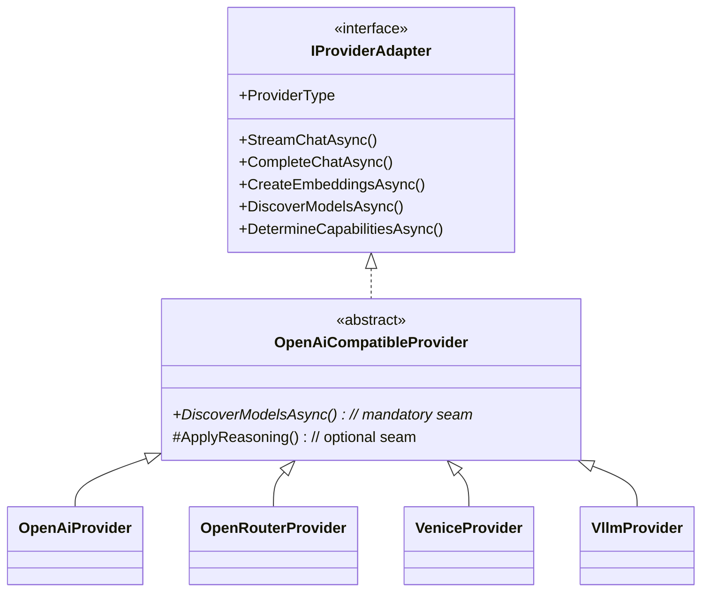

# Providers

> Part of the [OllamaProxy architecture docs](README.md).

A **provider** is the boundary between the proxy's provider-neutral core and one concrete upstream API. This
page covers the *structure* of that abstraction — the interfaces, the shared translation base, and how a
concrete provider specializes it. For the *behavior* of each transformation (exactly how a body is rewritten
on the way to a backend), see the operator-facing [Provider request handling](../provider-request-handling.md)
guide; this page links into it rather than repeating it.

## The two faces of a provider

The key idea is that a provider is split in two, and the two halves are read at different times for different
reasons. Each provider contributes both:

| | `IProviderAdapter` (behavior) | `ProviderDescriptor` (identity) |
| --- | --- | --- |
| What it is | The code that translates and forwards requests. | A cheap, options-free "business card". |
| Cost | Heavy; depends on the options graph and HTTP clients. | Immutable; constructs nothing. |
| Read when | Routing and serving a request. | Validating config, the admin picker, defaults. |
| Defined in | [`IProviderAdapter`](../../src/OllamaProxy/Providers/Abstractions/IProviderAdapter.cs) | [`ProviderDescriptor`](../../src/OllamaProxy/Providers/Abstractions/ProviderDescriptor.cs) |

Splitting them is what lets the proxy *know about* a provider (its display name, default mode, default URL)
without *constructing* it — so configuration validation can run without entering the options graph the
adapters depend on. A provider publishes its descriptor statically through `IProviderDescriptorSource`, and
`AddProvider<T>()` registers the adapter and the descriptor together (see [Composition](composition.md)).

## `IProviderAdapter` — the behavior boundary

The first face is the one that does the work.
[`IProviderAdapter`](../../src/OllamaProxy/Providers/Abstractions/IProviderAdapter.cs) is everything
provider-specific, expressed in provider-neutral terms. The core (endpoints, router) speaks only Ollama
contracts plus a `BackendContext`, so a new provider is added by implementing this interface, without
touching the core at all:

| Member | Role |
| --- | --- |
| `ProviderType` | The discriminator (e.g. `openai`) the resolver matches a backend against. |
| `StreamChatAsync()` | Streaming chat: one `OllamaChatResponse` chunk per upstream delta, plus a terminal `done` chunk. |
| `CompleteChatAsync()` | Non-streaming chat: the single aggregated response. |
| `CreateEmbeddingsAsync()` | Embeddings, translated to the Ollama embeddings shape. |
| `DiscoverModelsAsync()` | Lists the backend's models as provider-neutral `DiscoveredModel`s. |
| `DetermineCapabilitiesAsync()` | Resolves a model's capabilities (metadata → optional probe). |

These members split into a routing discriminator plus the two jobs a provider does. `ProviderType` is the
discriminator the resolver matches a backend against to select the adapter. The three chat and embedding
members then serve the [request path](request-path.md): they translate and forward a live request. The last
two feed [catalog & discovery](catalog-and-discovery.md): they tell the proxy what a backend offers and what
each model can do.

## `IProviderCatalog` — the descriptor aggregator

The second face is the cheap one, and this is what reads it.
[`IProviderCatalog`](../../src/OllamaProxy/Providers/Abstractions/IProviderCatalog.cs) is the single,
data-driven source of truth about which provider families ship and what each defaults to. It reads only the
descriptors and never the adapters, which is what makes it cheap and safe to consult during options
validation:

- `Providers` — every registered descriptor, in registration order (drives the admin picker).
- `IsSupported(providerType)` — the membership check config validation uses to reject an unknown type.
- `DefaultModeFor()` / `DefaultBaseUrlFor()` — the per-type defaults the admin UI prefills when a backend is added.
- `DisplayNameFor(providerType)` — the friendly label for a stored provider type. The admin backend card shows
  it as a quiet pill in its collapsed header, so the provider family is visible without expanding the card.
- `ResolveMode(backend)` — the backend's explicit `Mode`, or the provider default when unset. This is the
  **single place** the runtime catalog, the admin reconciler, and the editor read a backend's effective
  mode, so none of them can drift.

## `OpenAiCompatibleProvider` — the shared translation core

So far a provider sounds like a lot of code to write. In practice it is not, because almost none of it is
written per provider. Every shipped backend speaks the OpenAI REST format, so the bulk of the behavior
lives in one abstract base:
[`OpenAiCompatibleProvider`](../../src/OllamaProxy/Providers/OpenAiProtocol/OpenAiCompatibleProvider.cs). It
implements the entire protocol surface: `/chat/completions`, `/embeddings`, `/models`, request and response
translation, streaming, model discovery across several context-length and capability dialects, and the
verbatim `IOpenAiForwarder` passthrough for the inbound `/v1` surface.

What differs between vendors falls into two seams, one mandatory and one optional. The mandatory one is the
discovery projection: because `DiscoverModelsAsync()` is abstract, every provider maps its backend's native
listing onto the neutral `DiscoveredModel` — trivially for a metadata-poor backend, richly for one that
advertises context lengths and capabilities. The optional one is the reasoning dialect: a provider overrides
`ApplyReasoning()` only when its wire form deviates from the standard flat `reasoning_effort` field. So a
concrete provider declares its `ProviderType`, supplies a projection, and otherwise inherits everything. The
base keeps no state beyond its injected collaborators, so every adapter is a shared singleton.

## The concrete adapters

With the base doing the heavy lifting, each concrete adapter is small: it exists to capture one vendor's
deviations. The four that ship are:

| Adapter | Specializes for | Default mode |
| --- | --- | --- |
| [`OpenAiProvider`](../../src/OllamaProxy/Providers/OpenAi/OpenAiProvider.cs) | The official OpenAI API and any plain OpenAI-compatible backend (LM Studio, llama.cpp). | `Explicit` (metadata-poor) |
| [`OpenRouterProvider`](../../src/OllamaProxy/Providers/OpenRouter/OpenRouterProvider.cs) | OpenRouter's unified `reasoning` object and rich discovery metadata. | `PlugAndPlay` |
| [`VeniceProvider`](../../src/OllamaProxy/Providers/Venice/VeniceProvider.cs) | Venice's reasoning dialect and rich discovery metadata. | `PlugAndPlay` |
| [`VllmProvider`](../../src/OllamaProxy/Providers/Vllm/VllmProvider.cs) | Self-hosted vLLM. | `Explicit` (no fixed public URL) |

`OpenRouterProvider` and `VeniceProvider` are the two rich projections — the reason both default to
`PlugAndPlay`. Taking OpenRouter as the worked example: it overrides the reasoning seam to write the
`reasoning.effort` form, and its projection maps a top-level `context_length`, a nested
`top_provider.context_length`, an `architecture` modality block, and a `supported_parameters` list natively
onto the neutral `DiscoveredModel`. Venice is just as rich, but reports its capabilities as structured flags
(a `type` discriminator plus a `model_spec` block of vision/function-calling booleans) the adapter translates
into the same neutral modalities — and it additionally carries a weight `quantization` and a model source link
that OpenRouter omits.

## Adding a provider

Because the core speaks only the neutral contracts, a new OpenAI-compatible backend type is:

1. A class deriving from `OpenAiCompatibleProvider` that declares its `ProviderType`, a static `Descriptor`,
   and its discovery projection, overriding `ApplyReasoning()` only when its reasoning dialect deviates.
2. One `AddProvider<TNewProvider>()` line in
   [`ProviderServiceCollectionExtensions`](../../src/OllamaProxy/Providers/ProviderServiceCollectionExtensions.cs).

Nothing else changes. The resolver selects the new adapter by `ProviderType`, the catalog picks up its
descriptor for validation, defaults, and the admin picker, and the endpoints route to it unmodified. That
small surface, one class plus one registration line, is the payoff of the "room to grow" provider
abstraction the README highlights.

## Supporting collaborators

Two shared services round out the picture. They live alongside the adapters under
`Providers/OpenAiProtocol` and back the discovery and reasoning behavior described above:

- **`ICapabilityProber`** (`OpenAiCapabilityProber`) — the active probe the adapters fall back to when a
  model's discovery metadata carries no capability signal. See
  [catalog & discovery](catalog-and-discovery.md#capability-detection).
- **`IReasoningDetailsCache`** — carries a backend's opaque `reasoning_details` blob across a multi-turn
  tool-call conversation that the Ollama wire format cannot itself convey. The blob is an encrypted reasoning
  *signature* (distinct from the readable `reasoning_content` text that vLLM and others emit and the proxy
  shows as `Thinking`), which the model expects replayed verbatim. The round-trip is a uniform base-class
  behavior — every provider captures, caches, and re-attaches through the same `OpenAiCompatibleProvider`
  code path — so it fires purely on that field's presence. Only OpenRouter and Venice emit it; against the
  official OpenAI dialect or vLLM the same code runs but finds nothing to cache.
