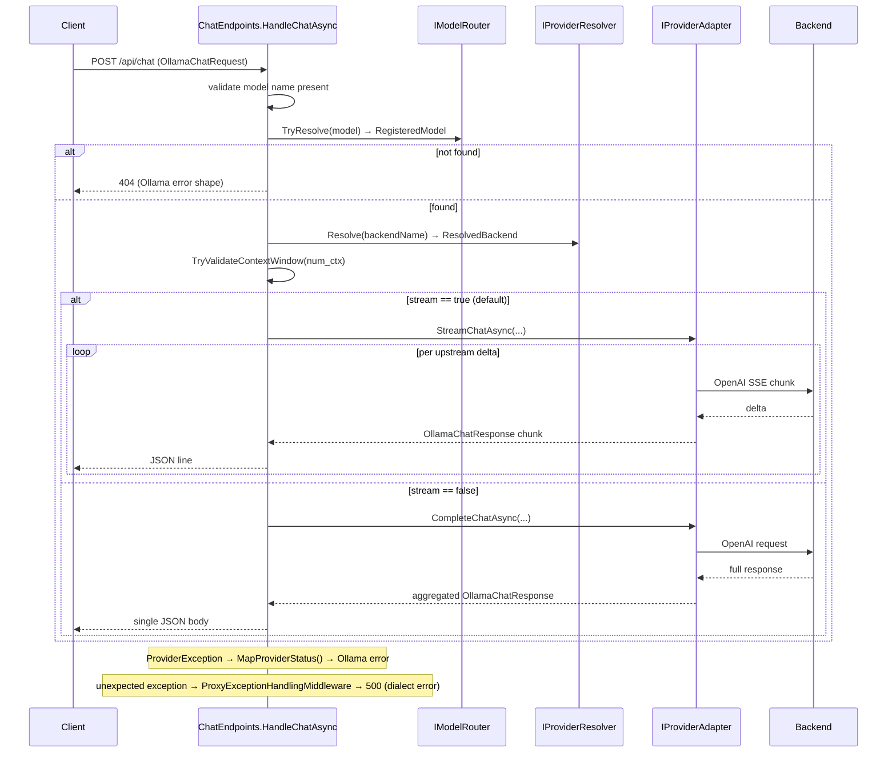

# Request path (data plane)

> Part of the [OllamaProxy architecture docs](README.md).

This page follows a single inbound request through the inner proxy host, from the HTTP endpoint to the
backend and back. It is the data plane — the hot path that runs on every chat, generate, and embeddings
call. (How the catalog it resolves against is *built* is the [control plane](catalog-and-discovery.md).)

We use `POST /api/chat` as the worked example; the other endpoints follow the same shape, on both the
Ollama and OpenAI surfaces.

## The shape of every handler

Before the worked example, it helps to know that every request endpoint has the same skeleton. Whatever the
verb, a handler does the same four things in the same order:

1. **Validate** the inbound request shape.
2. **Resolve** the client-facing model name to a backend and adapter.
3. **Translate and forward** to the backend, then **translate the response back**.
4. **Map failures** to the protocol's error shape.

Steps 2 and 4 are shared helpers, so each handler owns only its own validation and its response shaping.
That is why adding an endpoint is cheap: the routing and error handling are already written. The walkthrough
below traces one handler through all four.

## Worked example: `POST /api/chat`

Chat is the richest handler because it streams, so it shows all four steps at work.
[`ChatEndpoints.HandleChatAsync()`](../../src/OllamaProxy/Endpoints/ChatEndpoints.cs) is mapped in `MapChatEndpoints()`
and receives the deserialized `OllamaChatRequest`, plus the `IModelRouter` and `IProviderResolver` it needs,
by injection. The diagram shows the whole path; the numbered notes below walk through it.



### 1. Validate

The handler first checks only what is cheap to check locally: the request body and the model name. A missing
body or a blank `Model` returns `400` in the Ollama error shape via `OllamaHttp.WriteErrorAsync()`, before any
routing or network work is done.

### 2. Resolve

With a usable request in hand, the handler turns the client's model name into a concrete backend.
[`EndpointRouting.TryResolveBackend()`](../../src/OllamaProxy/Endpoints/EndpointRouting.cs) collapses the
two-step resolution every handler performs:

- [`IModelRouter.TryResolve()`](../../src/OllamaProxy/Core/ModelRouter.cs) maps the client-facing name to a
  `RegisteredModel` — the catalog entry that carries the serving backend, its upstream identifier, and the
  model's limits. Resolution is case-insensitive and strips a trailing `:latest` tag, so `name` and
  `name:latest` resolve to the same entry. A miss yields `404`.
- [`IProviderResolver.Resolve()`](../../src/OllamaProxy/Core/ProviderResolver.cs) reads the named backend
  from the validated `ProxyOptions` and returns a `ResolvedBackend` — the `IProviderAdapter` plus a
  `BackendContext`.

Both reads are built for the concurrent request load. The router serves reads from an **immutable snapshot
behind a `volatile` reference**: `TryResolve()` takes the current snapshot with one volatile read and never
locks. The resolver's adapter index and backend set are `FrozenDictionary`s built once at construction.
Neither read takes a lock, so requests never contend with each other or with a catalog rebuild.

One more guard runs here. `EndpointRouting.TryValidateContextWindow()` rejects a client `num_ctx` larger than
the model's resolved limit with an explicit `400`, so an oversized request fails fast and clearly instead of
failing opaquely deep inside the backend call.

### 3. Stream or complete

This is the skeleton's *translate and forward* step. Translation is the provider layer's job (covered at the
end of this step), so what remains here is the **forward**. The request is now validated and resolved, so the
handler forwards it. The Ollama API treats a **missing** `stream` flag as streaming, so the proxy defaults
`stream` to `true` to stay drop-in compatible. That choice splits the path in two:

- **Streaming** → `StreamAsync()` writes the response headers first, then writes each translated
  `OllamaChatResponse` chunk as a newline-delimited JSON line as it arrives, so the client receives tokens
  immediately and nothing buffers.
- **Non-streaming** → `CompleteAsync()` returns the single aggregated `OllamaChatResponse`.

Both call straight into the resolved `IProviderAdapter`. That interface is the handover: above it the
handler speaks the client's dialect and shapes the HTTP response; below it the adapter speaks the backend's
protocol. The translation itself — payload building, the reasoning seam, SSE-to-JSON-Lines conversion,
tool-call deltas — lives in the provider layer and is covered in [Providers](providers.md).

### 4. Map failures

The three steps above all assume success; this step covers the rest. Failures come in two kinds, and the
proxy handles each in a different place.

**Expected failures** are the ones a handler knows how to shape. A backend failure surfaces as a
`ProviderException`, which the handler catches and converts with `OllamaHttp.MapProviderStatus()` into the
matching HTTP status, again in the Ollama error shape. The division of labor is the point: routing,
capability, and translation concerns stay in the core and provider layers, while the handler only
orchestrates them and shapes the HTTP response.

**Unexpected failures** — a proxy bug, a faulting dependency — are not the handler's job to catch. They are
caught once, for every endpoint, by
[`ProxyExceptionHandlingMiddleware`](../../src/OllamaProxy/Endpoints/ProxyExceptionHandlingMiddleware.cs),
the pipeline's safety net. It logs the failure and returns a `500` in the surface's own dialect: the Ollama
`{ "error": ... }` body for an `/api/*` call, the OpenAI `{ "error": { "message", "type" } }` envelope for a
`/v1/*` call. It sits *inside* the tracing middleware, so a synthesized `500` is still recorded. It writes
nothing when the client has already disconnected (a cancelled `RequestAborted` is expected teardown, not a
fault) or when the response has already started (the headers are on the wire and cannot be rewritten).

## The two surfaces

The walkthrough above followed an `/api/*` call, but the same handler logic backs a second dialect. The one
catalog is served through **both** an Ollama-native (`/api/*`) and an OpenAI-compatible (`/v1/*`) surface on
the same port, mapped together by
[`MapOllamaApi()`](../../src/OllamaProxy/Endpoints/OllamaEndpointRouteBuilderExtensions.cs):

```csharp
endpoints.MapChatEndpoints();
endpoints.MapGenerateEndpoints();
endpoints.MapEmbeddingEndpoints();
endpoints.MapModelEndpoints();
endpoints.MapSystemEndpoints();
endpoints.MapOpenAiApi();
```

Both surfaces share the same `EndpointRouting` resolution helper, so a model resolves identically whichever
dialect a client uses. Some clients (GitHub Copilot) use both at once — discovery over `/api`, chat over
`/v1`. The full route list is in the [Endpoints](../endpoints.md) guide.

## Cross-cutting: cancellation and tracing

- **Cancellation.** Handlers take `context.RequestAborted` and thread it through the adapter to the
  backend call, so a disconnecting client tears the upstream request down rather than leaving it running.
- **Tracing.** The `RequestTracingMiddleware` wraps the whole pipeline (it is added before endpoint
  routing in `ProxyHostFactory`), so it observes both the inbound request and the final response. It is a
  no-op unless tracing is enabled in configuration. Redaction is split by concern: the middleware itself
  redacts credential-bearing **headers** (`Authorization`, `Cookie`, `api-key`, …) so a shared trace never
  leaks a token, while `TraceBodySanitizer` redacts only inline **attachment payloads** in the **body**
  (base64 images, data URLs) to keep traces small and readable. See the `Diagnostics/` folder for the sinks
  and both redaction stages.
